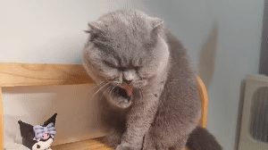

<h2> Hola!💕</h2>
⏳ Year progress { █████████████████████████▁▁▁▁▁ } 86.17 %

---

⏰ Updated on Tue, 11 Nov 2025 12:32:40 GMT

<picture>
  <source media="(prefers-color-scheme: dark)" srcset="https://raw.githubusercontent.com/serendipityerr/serendipityerr/output/github-contribution-grid-snake-dark.svg">
  <source media="(prefers-color-scheme: light)" srcset="https://raw.githubusercontent.com/serendipityerr/serendipityerr/output/github-contribution-grid-snake.svg">
  
</picture>

<picture>
  <source
    srcset="https://github-readme-stats.vercel.app/api?username=serendipityerr&show_icons=true&hide_border=true&line_height=24&theme=buefy"
    media="(prefers-color-scheme: radical)"
  />
  
</picture>
<picture>
  
</picture>

